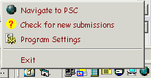



## Bobo PSC Monitor Update

### Description

This tiny app will inform you of new submissions on PSC and demonstrates how

to implement ownerdrawn menus to add icons and change the font/color of your menus

in the simplest way possible.

Years ago I posted a submission to monitor for new submissions on PSC. That

submission did much more than check for new postings and as such it broke

one of codings' golden rules - never hardcode addresses/strings. For that app

it was neccessary, but as is inevitable, things changed at PSC and elements

of that app have become inoperative accordingly. I've simplified this app to

only check for new submissions and the only hard coded address used is one that

is unlikely to change until a complete revamp of PSC occurs.
 
### More Info
 

             |
---                |---
**Submitted On**   |2003-05-24 22:29:02
**By**             |[MrBobo](https://github.com/Planet-Source-Code/PSCIndex/blob/master/ByAuthor/mrbobo.md)
**Level**          |Intermediate
**User Rating**    |4.9 (34 globes from 7 users)
**Compatibility**  |VB 6\.0
**Category**       |[VB function enhancement](https://github.com/Planet-Source-Code/PSCIndex/blob/master/ByCategory/vb-function-enhancement__1-25.md)
**World**          |[Visual Basic](https://github.com/Planet-Source-Code/PSCIndex/blob/master/ByWorld/visual-basic.md)
**Archive File**   |[Bobo\_PSC\_M1592045242003\.zip](https://github.com/Planet-Source-Code/mrbobo-bobo-psc-monitor-update__1-45685/archive/master.zip)

